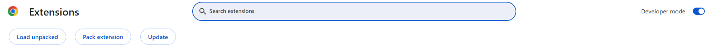

# Feedy EXT - Brand Sentiment Analysis
Google Chrome Built-in AI Challenge
 

## Team: 
- [Helena Rodríguez Cagide](www.linkedin.com/in/helena-rodriguez-cagide)
- [Nicoleta Radulescu](https://www.linkedin.com/in/cornelia-nicoleta-radulescu-6b3b7b16a/)
- [Christian Stoyanov](https://www.linkedin.com/in/christian-stoyanov/)
- [Silviu Daniel Eftimie](https://www.linkedin.com/in/eftimiesilviudaniel/)

## Slides: [presentation](https://docs.google.com/presentation/d/1FMSB0SC8emAEIaiQybZuFdGAlA1DWjexGg-lQh_6zu4/edit?usp=sharing)
 
## Pillars:

### 1. Problem Statement  
Today, brands face a big challenge on social media. Community managers typically work only during office hours, while users are most active late at night and on weekends. This mismatch means negative comments can go unaddressed, which can damage a brand's image.  

**Feedy EXT** solves this problem: it’s a Chrome extension that monitors and responds to user comments across multiple platforms and languages, ensuring that no interactions are missed, no matter the time. With **Feedy EXT**, brands can better manage their image and understand customer feedback.  

---  

### 2. Overview, Target Audience, and Value  

**Feedy EXT** is designed for social media and PR teams, as well as brands aiming to optimize their digital platform management. The extension centralizes comments from platforms such as LinkedIn, Google My Business, TikTok, Twitter, Facebook, and Instagram into one tool.  

Additionally, it includes a centralized dashboard that provides valuable insights into social media conversations related to the brand. This enables brands to:  
- **Quickly respond to negative comments**, even outside business hours.  
- **Automate actions** like liking positive or neutral comments.  
- **Gain insights into customer sentiment**, helping improve products and services.  

### Target Audience:  
- **Social media and PR teams:** Simplifies user management and response.  
- **Brands:** Enhances audience connection by offering a unified and automated view of feedback across all platforms.  

---  

### 3. Core Functionalities, APIs, and GCP Serverless Products  

**Feedy EXT** leverages advanced technologies to deliver a robust and scalable experience:  

### Core Functionalities:  
1. **Sentiment Analysis:** Classifies comments as positive, negative, or neutral.  
2. **Automated Actions:**  
   - Automatically likes positive and neutral comments.  
   - Suggests responses for negative comments.  
3. **Centralized Dashboard:**  
   - Visualizes data in Looker Studio with customizable filters and charts.  
4. **Multi-platform Compatibility:** Manage multiple social media accounts from one place.  

### APIs and Tools Used:  
- **Chrome Prompt API:** For real-time analysis and classification of comments.  
- **Vertex AI:** Advanced data processing when the device doesn’t support Chrome’s capabilities.  
- **Google BigQuery:** Secure and scalable data storage.  
- **Looker Studio:** Visualization of insights with customizable charts and trends.  
- **Google Cloud Run:** Serverless and scalable services for reliable performance.  

**Feedy EXT** is designed to scale effortlessly, ensuring that brands can manage multiple accounts and platforms without complications.  

---  

### Try Feedy EXT!  
Discover how this tool can transform the way your brand manages social media, ensuring a strong connection with your audience 24/7. 🚀  

--- 

## 4. Feedy EXT in Action:

### Prerequisites  

1. **Create a Google Cloud Platform (GCP) project:**  
   - Enable the following APIs:  
     - **Cloud Run**  
     - **Cloud Build**  
     - **BigQuery**  

2. **Set up environment parameters:**  
   - Configure the following environment variables:  
     - `GCP_PROJECT_ID`: Your GCP project ID.  
     - `BIGQUERY_DATASET_ID`: Your BigQuery dataset ID.  
     - `BIGQUERY_TABLE_ID`: Your BigQuery table ID.  

---

### Setup Steps  

1. **Use Google Cloud Shell**
   - Open **GCP Cloud Shell** from the Google Cloud Console.  

2. **Clone the Repository**
   - Run the following command to clone the repository: 
    `git clone https://github.com/seftimie/feedyext`

3. **Navigate to the Project Directory and Run Setup**
   - Move into the cloned project directory:
    `cd feedyext/`

   - Execute the setup script by running:
    `bash setup.sh`

4. **Install the Chrome Extension**
   - Open Google Chrome and click on the puzzle icon (Extensions) in the top right corner of the window, after that, click on **Manage Extensions**
   - Once open, **enable Developer mode** in the top right.

  

   - Then click on **Load unpacked** and select `feedyext/extension` folder.
 
     
5.  **Analyze a LinkedIn Post**
    - Go to [LinkedIn](https://www.linkedin.com/), open a post, and click the **"Analyze"** button.
    - The extension will analyze the post's comments, providing insights into sentiment and engagement.
    - In the **Actions** section, you can automatically **like** positive comments to help boost engagement.
    - Review the actions and insights generated by the extension to better understand the post’s performance and interactions.
  
--- 

**You're All Set!**
Feedy EXT is now ready to help you automate and simplify social media management. 🚀
